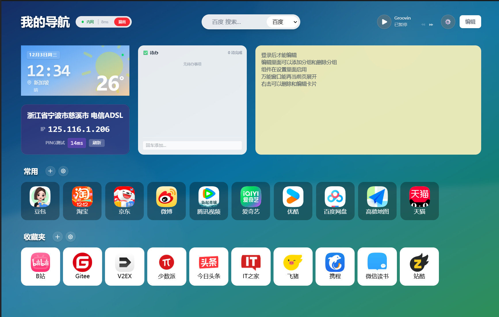
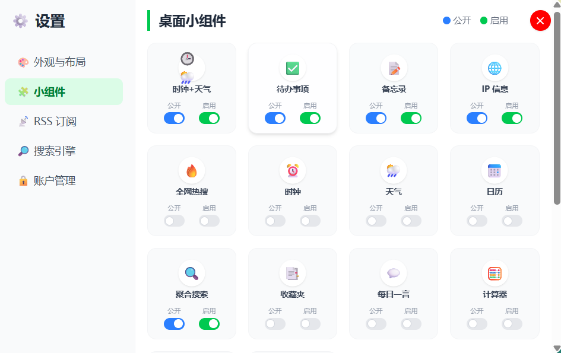

# FlatNas

[](https://github.com/Garry-QD/FlatNas)
[](https://gitee.com/gjx0808/FlatNas)
[](https://hub.docker.com/r/qdnas/flatnas)

FlatNas 是一个轻量级、高度可定制的个人导航页与仪表盘系统。它基于 Vue 3 和 Express 构建，旨在为 NAS 用户、极客和开发者提供一个优雅的浏览器起始页。
交流QQ群:613835409

## ✨ 主要功能

   

### 🖥️ 仪表盘与布局

- **网格布局**: 自由拖拽布局，支持不同尺寸的组件。
- **分组管理**: 支持创建多个分组，分类管理应用和书签。
- **响应式设计**: 完美适配桌面端和移动端访问。
- **编辑模式**: 直观的所见即所得编辑体验，轻松添加、删除和重新排列组件。

### 🧩 丰富的小组件

FlatNas 内置了多种实用的小组件，满足日常需求：

- **书签组件**: 快速访问常用网站，支持自定义图标。首次启动时会自动填充常用的 10 个网站（如 GitHub, Bilibili 等）。
- **时钟与天气**: 实时显示当前时间、日期及当地天气情况。
- **待办事项 (Todo)**: 简单的任务管理，随时记录灵感和待办。
- **RSS 订阅**: 内置 RSS 阅读器，实时获取订阅源的最新内容。
- **热搜榜单**: 集成微博热搜、新闻热榜等，不错过即时热点。
- **计算器**: 随时可用的简易计算器。
- **音乐播放器**: 内置 MiniPlayer，支持播放服务器端的本地音乐文件。

### 🎨 个性化定制

- **图标管理**: 内置图标库，支持上传自定义图片，并全面支持 **Hex 颜色代码** (如 `#ffffff`) 自定义图标背景色。
- **背景设置**: 支持自定义壁纸。
- **分组卡片背景**: 支持在分组设置中统一配置该组所有卡片的背景（图片、模糊、遮罩），实现风格统一的视觉效果。
- **访客统计**: 底部页脚显示网站总访问量、今日访问量及当前在线时长（需在设置中开启）。
- **数据安全**:
  - 本地存储配置 (`server/data/data.json`)，数据完全掌握在自己手中。
  - 简单的密码访问保护（默认密码：`admin`），保护隐私配置。
- **CGI 扩展**: 支持通过 Node.js 编写 CGI 脚本扩展后端功能（位于 `server/cgi-bin`）。
- **更新提醒**: 内置版本检测功能，自动检查 GitHub 最新 Release 版本，并在设置面板提示 Docker 更新。

## 📅 最近更新 (v1.0.13)

- **功能新增**:
  - **自定义天气源**: 天气组件支持配置自定义 API 源，满足个性化数据需求。
  - **设置分类优化**: "万能窗口"相关设置独立为单独的标签页，管理更加便捷清晰。
- **体验优化**:
  - **界面调整**: 优化了万能窗口设置页的按钮布局，防止遮挡。
  - **引导提示**: 在相关设置项增加了关于浏览器插件的引导提示，帮助解决跨域访问问题。

## 📅 历史更新 (v1.0.12)

- **功能新增**:
  - **音乐上传**: 添加了音乐文件的上传入口，支持批量添加音乐文件。
  - **图标搜索**: 添加了图标的模糊搜寻组件，查找图标更便捷。
  - **备注功能**: 添加了水平模式下的备注功能。
  - **导入支持**: 支持通过 JSON 文件新增项目（指定格式）。
- **性能与优化**:
  - **缓存优化**: 添加原子写入优化缓存机制，减少缓存问题。
  - **布局优化**: 优化垂直模式下无卡片的尺寸逻辑。
  - **插件更新**: 优化万能窗口浏览器插件（内测中）并推送到 GitHub。

## 📅 历史更新 (v1.0.11)

- **书签组件增强**:
  - **自动抓取**: 添加书签时，只需输入网址，系统会自动抓取网页的**标题**和**图标**，大幅简化操作流程。
  - **后端代理**: 新增 `/api/fetch-meta` 接口，利用服务端代理请求解决前端跨域 (CORS) 问题，抓取成功率更高。
  - **一键导入**: 支持导入浏览器书签文件 (\*.html)，自动创建新分类并批量导入书签。
- **界面优化**:
  - **布局调整**: 书签组件由原来的网格布局改为垂直列表布局，展示更多信息（标题、URL），更加清晰易读。

## 📅 历史更新 (v1.0.9)

- **组件功能增强**:
  - **全组件自由尺寸**: 万能窗口（Iframe）的 4x4 自由尺寸选择功能现已扩展至**所有小组件**，布局更加灵活。
- **界面优化**:
  - **设置页底部重构**: 优化了设置面板底部的版权信息区域，采用双行布局（版本号与图标分离），视觉更加清爽。
  - **图标更新**: 替换了 GitHub 和 Docker 的图标为官方高清素材。
  - **新版本提醒**: 在版本号旁新增了红点提醒功能，当检测到新版本时自动提示。

## 📅 历史更新 (v1.0.7)

- **交互体验优化**:
  - 修复了卡片拖拽排序后状态更新延迟的问题，现在拖动即可实时保存。
  - 修复了编辑模式下拖动卡片后，再次编辑卡片导致位置重置的问题。
  - 优化了拖拽逻辑，在搜索状态下禁用拖拽，防止误操作。
- **视觉修复**:
  - 修复了图标背景色无法正确识别 Hex 颜色代码导致显示为黑色的问题。

## 📅 历史更新 (v1.0.6)

- **视觉体验优化**: 调整了小组件卡片的字体大小 (14px) 和间距，提升了在不同屏幕下的阅读舒适度。
- **更新提醒功能**: 新增 Docker 版本更新检测机制。
  - 系统会自动检查 GitHub Releases 的最新版本。
  - 当有新版本时，设置面板会显示红色更新提醒，点击可直达 Release 页面。

## 🌐 智能网络环境检测

FlatNas 后端集成了智能网络环境识别功能，能够根据用户的访问来源自动切换内外网访问策略，完美解决混合网络环境下的访问难题。

### 1. 功能描述

- **多维度识别**: 结合 **客户端 IP**、**访问域名** 和 **网络延迟** 三个维度，精准判断用户当前所处的网络环境（局域网/互联网）。
- **自动路由**: 当检测到用户处于局域网（LAN）时，系统会自动优先使用配置的 **内网地址 (LanUrl)**，实现高速直连；在公网环境则自动切换至 **外网地址**。
- **无感切换**: 用户无需手动干预，无论是在家（内网）还是外出（外网），点击同一个图标即可自动跳转至最佳地址。

### 2. 技术实现

#### 核心检测逻辑

后端 (`server/server.js`) 与前端协同工作，实现了以下检测流程：

1.  **IP 来源分析**:
    - 后端通过解析 HTTP 请求头中的 `X-Forwarded-For` 和 `Socket Remote Address` 获取真实客户端 IP。
    - 支持 **IPv4/IPv6 双栈** 识别，自动处理 `::ffff:` 映射格式。
2.  **网络连通性探测**:
    - 提供 `/api/ping` 接口，后端调用系统底层 ICMP 协议探测目标主机（默认 223.5.5.5）的延迟。
    - 用于辅助判断服务器是否具备外网访问能力。
3.  **环境判断算法**:
    ```javascript
    // 前端综合判定逻辑
    const isLanMode =
      isInternalIp(clientIp) || // 客户端IP属于内网段 (192.168.x.x, 10.x.x.x, etc.)
      isInternalHostname(window.location.hostname); // 访问域名属于内网 (localhost, .local)
    ```

### 3. 使用指南

1.  **配置内网地址**:
    - 在编辑模式下，右键点击任意组件选择"编辑"。
    - 在弹出的对话框中，除了填写"链接地址"（外网）外，还可以填写 **"内网链接"**。
2.  **典型场景**:
    - **家庭 NAS**: 外网填 `https://nas.yourdomain.com`，内网填 `http://192.168.1.10:5000`。
    - **开发调试**: 自动识别 `localhost` 访问，优先走本地服务端口。

### 4. 注意事项

- **反向代理设置**: 如果使用 Nginx/Traefik 等反向代理，务必透传真实 IP，否则后端可能无法正确识别客户端来源：
  ```nginx
  proxy_set_header X-Forwarded-For $proxy_add_x_forwarded_for;
  ```
- **Fallback 机制**: 如果未配置内网地址，即使在内网环境也会回退使用外网地址，确保服务可用性。

## 📂 项目结构

```
FlatNas/
├── src/                # 前端 Vue 源码
├── server/             # 后端 Express 服务
│   ├── data/           # [重要] 用户数据存储 (data.json)
│   ├── music/          # [重要] 音乐文件目录
│   ├── cgi-bin/        # CGI 脚本目录
│   └── server.js       # 后端入口
├── public/             # 静态资源 (图标等)
├── dist/               # 构建产物
└── ...
```

## 🛠️ 技术栈

- **环境要求**: Node.js ^20.19.0 || >=22.12.0
- **前端**: Vue 3, Vite, TypeScript, TailwindCSS, Pinia
- **后端**: Node.js, Express
- **数据存储**: JSON 文件存储 (无需配置数据库)
- **其他**: RSS Parser, Vue Draggable Plus

## 🚀 快速开始

### 本地开发

1. **克隆项目**

   ```bash
   git clone <your-repo-url>
   cd FlatNas
   ```

2. **安装依赖**

   ```bash
   npm install
   ```

3. **启动项目**
   该命令会同时启动前端开发服务器和后端 API 服务：

   ```bash
   npm start
   ```

   > **⚠️ Windows 用户注意**: 如果在 PowerShell 中运行 `npm start` 遇到执行策略错误（如 `UnauthorizedAccess`），请尝试以下解决方案：
   >
   > - 使用 `Command Prompt (cmd)` 运行命令。
   > - 或者手动分别运行服务：
   >
   >   ```bash
   >   # 终端 1 (后端)
   >   node server/server.js
   >
   >   # 终端 2 (前端)
   >   node node_modules/vite/bin/vite.js
   >   ```
   - 前端地址: `http://localhost:5173`
   - 后端地址: `http://localhost:3000`

### 部署构建

1. **构建前端**

   ```bash
   npm run build
   ```

   构建产物将生成在 `dist` 目录下。

2. **运行生产服务**
   ```bash
   npm run server
   ```
   此时可以通过 `http://localhost:3000` 访问完整应用（后端会托管 `dist` 目录下的静态文件）。

## 🐳 Docker 部署

项目包含 `Dockerfile`，支持容器化部署。

1. **构建镜像**

   ```bash
   docker build -t flatnas .
   ```

2. **运行容器**

   ```bash
   docker run -d \
     -p 3000:3000 \
     -v $(pwd)/server/data:/app/server/data \
     -v $(pwd)/server/music:/app/server/music \
     --name flatnas \
     flatnas
   ```

   > **注意**: 建议挂载 `data` 和 `music` 目录，以确保配置数据和音乐文件在容器重启后不会丢失。

3. **docker-compose**

   ```bash
   version: '3.8'

   services:
     flatnas:
       image: qdnas/flatnas:latest
       container_name: flatnas
       restart: unless-stopped
       ports:
         - '23000:3000'
       volumes:
         - ./data:/app/server/data #指定路径下新建data
         - ./music:/app/server/music #映射播放器路径
   ```

## 🚀 一键部署 (Debian)

如果您使用 Debian 系统，可以使用我们提供的自动化脚本进行无 Docker 部署。
详细指南请参考：[一键部署文档](README_DEPLOY.md)

### 快速安装（推荐）

无需手动下载代码，直接运行以下命令即可：

```bash
wget -O deploy.sh https://raw.githubusercontent.com/Garry-QD/FlatNas/main/deploy.sh && sudo bash deploy.sh install
```

### 手动安装

```bash
git clone https://github.com/Garry-QD/FlatNas.git
cd FlatNas
chmod +x deploy.sh
sudo ./deploy.sh install
```

## ⚙️ 配置说明

- **默认密码**: 系统初始密码为 `admin`，请登录后在设置中及时修改。
- **数据文件**: 所有配置（布局、组件、书签等）均存储在 `server/data/data.json` 中。
- **音乐文件**: 将 MP3 文件放入 `server/music` 目录，刷新页面后即可在播放器中看到。
- **CGI 脚本**: 将自定义脚本放入 `server/cgi-bin` 目录，可通过 `/cgi-bin/script.cgi` 访问。

## 📝 待办事项 / 计划

- [ ] 增加更多第三方服务集成
- [ ] 优化移动端交互体验
- [ ] 支持多用户系统
- [ ] 在线更换壁纸库

## 📜 开源协议

本项目采用 [GNU AGPLv3](LICENSE) 协议开源。

---

Enjoy your FlatNas! 🚀
